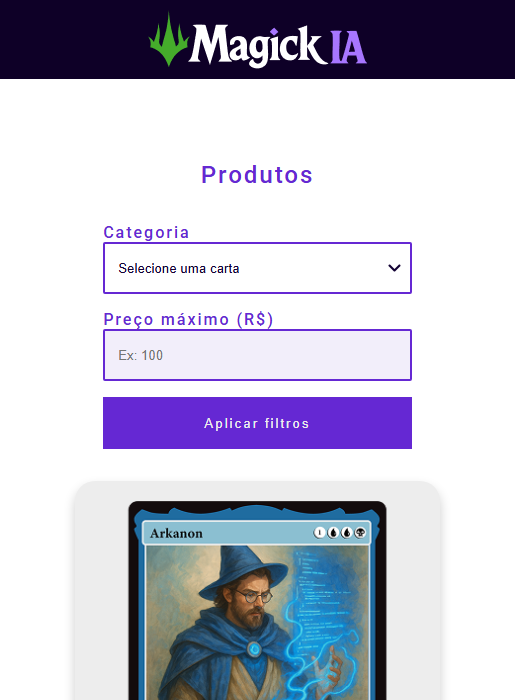

# 🧙‍♂️ Projeto Magick IA - E-commerce de Cartas

## 📄 Resumo do Projeto

Este é um projeto de Front-end que simula uma loja virtual (e-commerce) especializada em cartas de RPG colecionáveis. O objetivo principal da aplicação é exibir uma lista de produtos (cartas) e fornecer ao usuário a funcionalidade de **filtrar** esses itens.

O usuário pode filtrar as cartas de duas maneiras simultâneas:

1. **Por Categoria:** Selecionando a raridade da carta (Comum, Rara ou Épica).
2. **Por Preço Máximo:** Definindo um valor limite para visualizar apenas as cartas que cabem no orçamento.

Além disso, cada carta possui um botão "Comprar" que redireciona o usuário para o WhatsApp com uma mensagem pré-definida de interesse naquele produto específico.

## 📸 Screenshot

## 🔗 Links

- **Repositório:** [Acesse o repositório do Projeto Magick IA aqui](https://github.com/jsales25/projeto-magick-ia.git)
- **Live Site (GitHub Pages):** [Acesse o site do Projeto Magick IA aqui](https://jsales25.github.io/projeto-magick-ia/)

## 🛠️ Tecnologias Utilizadas

- **HTML5:** Estrutura semântica da página.
- **CSS3:** Estilização, Flexbox para layout e Media Queries para responsividade.
- **JavaScript:** Lógica de manipulação do DOM e filtros de busca.

## 🧠 O que eu aprendi

Durante o desenvolvimento deste projeto, pude praticar e reforçar os seguintes conceitos:

- **Manipulação do DOM:** Selecionar elementos HTML (`querySelector`, `querySelectorAll`) e modificar suas classes (`classList.add`, `classList.remove`) para mostrar ou esconder elementos.
- **Event Listeners:** Como escutar eventos de interação do usuário, especificamente o evento de `click` no botão de filtrar.
- **Lógica de Programação:** Implementação de condicionais (`if/else`) compostas para verificar múltiplos critérios de filtro (categoria e preço) ao mesmo tempo.
- **Atributos de Dados (Data Attributes):** Uso de `data-categoria` e `data-preco` no HTML para armazenar informações que são recuperadas pelo JavaScript.
- **Responsividade:** Criação de um layout que se adapta a diferentes tamanhos de tela.

## 👩‍💻 Autor

**Julia Sales**

- **GitHub:** [Acesse o GitHub da autora aqui](https://github.com/jsales25)
- **Frontend Mentor:** [Acesse o Frontend Mentor da autora aqui](https://www.frontendmentor.io/profile/jsales25)
- **LinkedIn:** [Acesse o LinkedIn da autora aqui](https://www.linkedin.com/in/julia-sales-developer/)

---

  Feito com 💜 por Julia Sales

